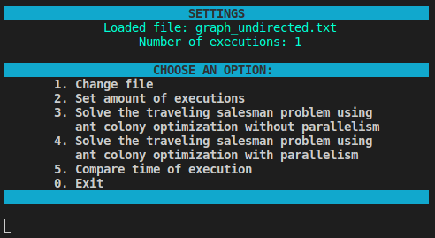
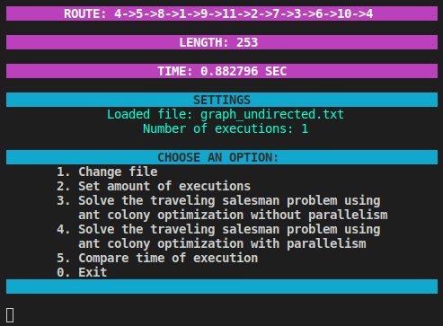
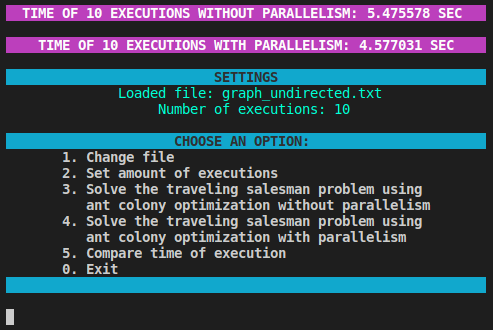

# Ant Colony Optimization v2.0 Multithreading
The "Ant" is an app written in C++. The console application provides implementation ant colony optimization algorithm for solving the travelling salesman problem with possibility to use parallel computing.

#### Program launch options

```
make run_ant
```

## Features
- Console interface

  

- Load graph as adjacency matrix from a specific file.
- Select amount of executions of algoritm.
- Solve TSM problem without parallelism.
- Solve TSM problem with parallelism.

  

- Compare obtained time of executions.

  

## License
Copyright (c). All rights reserved.
